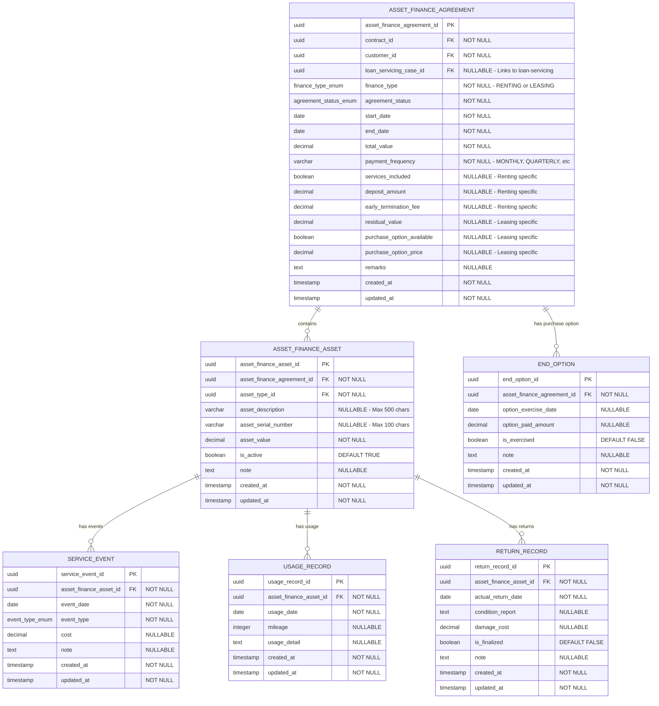

# Core Lending Asset Finance

[](https://opensource.org/licenses/Apache-2.0)
[](https://openjdk.java.net/)
[](https://spring.io/projects/spring-boot)

A unified microservice for managing both **renting** and **leasing** asset finance agreements within the Firefly lending platform.

---

## Table of Contents

- [Overview](#overview)
- [Purpose](#purpose)
- [Architecture](#architecture)
  - [Module Structure](#module-structure)
  - [Technology Stack](#technology-stack)
  - [Key Design Principles](#key-design-principles)
- [Domain Model](#domain-model)
  - [Entity Relationship Diagram](#entity-relationship-diagram)
  - [Entities](#entities)
  - [Enumerations](#enumerations)
- [API Endpoints](#api-endpoints)
  - [Asset Finance Agreements](#asset-finance-agreements)
  - [Assets](#assets)
  - [End Options](#end-options)
  - [Service Events](#service-events)
  - [Usage Records](#usage-records)
  - [Return Records](#return-records)
- [Getting Started](#getting-started)
  - [Prerequisites](#prerequisites)
  - [Environment Variables](#environment-variables)
  - [Build and Run](#build-and-run)
- [Development](#development)
  - [Project Structure](#project-structure)
  - [Database Migrations](#database-migrations)
  - [Testing](#testing)
- [Integration](#integration)
- [License](#license)

---

## Overview

This microservice consolidates the previously separate `core-lending-renting` and `core-lending-leasing` services into a single, unified codebase. The two modules shared approximately 90% of their code, making this merge a significant improvement in maintainability and consistency.

**Key Benefits:**
- ✅ 90% code reduction through elimination of duplication
- ✅ Unified API for both renting and leasing
- ✅ Single deployment reduces operational complexity
- ✅ Easier maintenance with one codebase
- ✅ Consistent business logic across finance types

---

## Purpose

The **Core Lending Asset Finance** microservice is responsible for:

1. **Managing Asset Finance Agreements** - Creating and maintaining both renting and leasing agreements with customers
2. **Asset Tracking** - Managing individual assets associated with finance agreements, including their descriptions, serial numbers, and values
3. **Lease-End Options** - Handling purchase options available at the end of leasing agreements
4. **Service Event Management** - Tracking maintenance, damage, inspections, and modifications to financed assets
5. **Usage Monitoring** - Recording asset usage metrics such as mileage and operating hours
6. **Return Processing** - Managing the return of assets at the end of agreements, including condition assessments and damage costs
7. **Integration with Loan Servicing** - Linking finance agreements to loan servicing cases for payment processing and account management

This microservice does **NOT** handle:
- Payment processing (handled by `core-lending-loan-servicing`)
- Repayment schedules (handled by `core-lending-loan-servicing`)
- Installment calculations (handled by `core-lending-loan-servicing`)

---

## Architecture

### Module Structure

```
core-lending-asset-finance/
├── core-lending-asset-finance-interfaces/  # DTOs, Enums, API Contracts
├── core-lending-asset-finance-models/      # JPA Entities, Repositories, Database Schema
├── core-lending-asset-finance-core/        # Business Logic, Services, Mappers
├── core-lending-asset-finance-web/         # REST Controllers, Spring Boot Application
└── core-lending-asset-finance-sdk/         # Client SDK, OpenAPI Specification
```

**Module Responsibilities:**

- **interfaces**: Data Transfer Objects (DTOs) and enumerations used across all layers
- **models**: Database entities, R2DBC repositories, and Flyway migration scripts
- **core**: Service interfaces and implementations, MapStruct mappers, business logic
- **web**: REST API controllers, Spring Boot configuration, application entry point
- **sdk**: Client SDK generation and OpenAPI specification

### Technology Stack

- **Language**: Java 21
- **Framework**: Spring Boot 3.x with Spring WebFlux (Reactive)
- **Database**: PostgreSQL with R2DBC (Reactive Database Connectivity)
- **Migration**: Flyway
- **API Documentation**: SpringDoc OpenAPI 3.0
- **Mapping**: MapStruct
- **Build Tool**: Maven
- **Architecture**: Reactive, Non-blocking I/O

### Key Design Principles

1. **Finance Type Discriminator**: The unified model uses a `financeType` field (`RENTING` or `LEASING`) to distinguish between use cases, allowing shared infrastructure while maintaining business logic flexibility.

2. **Reactive Programming**: Built on Spring WebFlux and R2DBC for non-blocking, scalable operations.

3. **Domain-Driven Design**: Clear separation between domain entities, DTOs, and service layers.

4. **External Integration**: Links to `core-lending-loan-servicing` via `loanServicingCaseId` for payment and account management.

---

## Domain Model

### Entity Relationship Diagram



### Entities

#### AssetFinanceAgreement

The core entity representing a renting or leasing agreement.

**Key Fields:**
- `assetFinanceAgreementId` (UUID, PK): Unique identifier
- `contractId` (UUID, FK): Reference to contract in contract management system
- `customerId` (UUID, FK): Reference to customer
- `loanServicingCaseId` (UUID, FK): Links to loan servicing case for payment processing
- `financeType` (FinanceTypeEnum): RENTING or LEASING
- `agreementStatus` (AgreementStatusEnum): Current status of the agreement
- `startDate` (LocalDate): Agreement start date
- `endDate` (LocalDate): Agreement end date
- `totalValue` (BigDecimal): Total value of the agreement
- `paymentFrequency` (String): Payment frequency (MONTHLY, QUARTERLY, YEARLY)

**Renting-Specific Fields:**
- `servicesIncluded` (Boolean): Whether services are included
- `depositAmount` (BigDecimal): Security deposit amount
- `earlyTerminationFee` (BigDecimal): Fee for early termination

**Leasing-Specific Fields:**
- `residualValue` (BigDecimal): Residual value at end of lease
- `purchaseOptionAvailable` (Boolean): Whether purchase option is available
- `purchaseOptionPrice` (BigDecimal): Price for purchase option

**DTO:** `AssetFinanceAgreementDTO` in `com.firefly.core.lending.assetfinance.interfaces.dtos.agreement.v1`

---

#### AssetFinanceAsset

Represents individual assets associated with a finance agreement.

**Key Fields:**
- `assetFinanceAssetId` (UUID, PK): Unique identifier
- `assetFinanceAgreementId` (UUID, FK): Parent agreement
- `assetTypeId` (UUID, FK): Reference to asset type
- `assetDescription` (String): Description of the asset (max 500 chars)
- `assetSerialNumber` (String): Serial number (max 100 chars)
- `assetValue` (BigDecimal): Value of the asset
- `isActive` (Boolean): Whether the asset is currently active

**DTO:** `AssetFinanceAssetDTO` in `com.firefly.core.lending.assetfinance.interfaces.dtos.assets.v1`

---

#### EndOption

Represents lease-end purchase options for leasing agreements.

**Key Fields:**
- `endOptionId` (UUID, PK): Unique identifier
- `assetFinanceAgreementId` (UUID, FK): Parent agreement
- `optionExerciseDate` (LocalDate): Date when option was/will be exercised
- `optionPaidAmount` (BigDecimal): Amount paid for the option
- `isExercised` (Boolean): Whether the option has been exercised

**DTO:** `EndOptionDTO` in `com.firefly.core.lending.assetfinance.interfaces.dtos.option.v1`

---

#### ServiceEvent

Tracks maintenance, damage, inspections, and modifications to assets.

**Key Fields:**
- `serviceEventId` (UUID, PK): Unique identifier
- `assetFinanceAssetId` (UUID, FK): Parent asset
- `eventDate` (LocalDate): Date of the event
- `eventType` (EventTypeEnum): Type of event (MAINTENANCE, DAMAGE, RETURN, INSPECTION, MODIFICATION)
- `cost` (BigDecimal): Cost associated with the event

**DTO:** `ServiceEventDTO` in `com.firefly.core.lending.assetfinance.interfaces.dtos.event.v1`

---

#### UsageRecord

Records usage metrics for assets (e.g., mileage, operating hours).

**Key Fields:**
- `usageRecordId` (UUID, PK): Unique identifier
- `assetFinanceAssetId` (UUID, FK): Parent asset
- `usageDate` (LocalDate): Date of usage recording
- `mileage` (Integer): Mileage or usage metric
- `usageDetail` (String): Additional usage details

**DTO:** `UsageRecordDTO` in `com.firefly.core.lending.assetfinance.interfaces.dtos.usage.v1`

---

#### ReturnRecord

Manages asset returns at the end of agreements.

**Key Fields:**
- `returnRecordId` (UUID, PK): Unique identifier
- `assetFinanceAssetId` (UUID, FK): Parent asset
- `actualReturnDate` (LocalDate): Date asset was returned
- `conditionReport` (String): Condition assessment report (max 2000 chars)
- `damageCost` (BigDecimal): Cost of damages
- `isFinalized` (Boolean): Whether the return is finalized

**DTO:** `ReturnRecordDTO` in `com.firefly.core.lending.assetfinance.interfaces.dtos.usage.v1`

---

### Enumerations

#### FinanceTypeEnum

Distinguishes between renting and leasing agreements.

**Values:**
- `RENTING`: Rental agreement
- `LEASING`: Lease agreement

**Package:** `com.firefly.core.lending.assetfinance.interfaces.enums.finance.v1`

---

#### AgreementStatusEnum

Represents the current status of a finance agreement.

**Values:**
- `ACTIVE`: Agreement is currently active
- `SUSPENDED`: Agreement is temporarily suspended
- `CLOSED`: Agreement has been closed normally
- `TERMINATED`: Agreement was terminated early
- `DEFAULTED`: Agreement is in default

**Package:** `com.firefly.core.lending.assetfinance.interfaces.enums.agreement.v1`

---

#### EventTypeEnum

Categorizes service events for assets.

**Values:**
- `MAINTENANCE`: Regular maintenance event
- `DAMAGE`: Damage to the asset
- `RETURN`: Asset return event
- `INSPECTION`: Inspection event
- `MODIFICATION`: Modification to the asset

**Package:** `com.firefly.core.lending.assetfinance.interfaces.enums.event.v1`

---

## API Endpoints

All endpoints are prefixed with `/api/v1` and support reactive (non-blocking) operations.

### Asset Finance Agreements

**Base Path:** `/api/v1/asset-finance-agreements`

| Method | Endpoint | Description |
|--------|----------|-------------|
| GET | `/` | List/Search all agreements with filtering and pagination |
| POST | `/` | Create a new asset finance agreement |
| GET | `/{assetFinanceAgreementId}` | Get agreement by ID |
| PUT | `/{assetFinanceAgreementId}` | Update an existing agreement |
| DELETE | `/{assetFinanceAgreementId}` | Delete an agreement |

**Controller:** `AssetFinanceAgreementController`
**Service:** `AssetFinanceAgreementService`

---

### Assets

**Base Path:** `/api/v1/asset-finance-agreements/{agreementId}/assets`

| Method | Endpoint | Description |
|--------|----------|-------------|
| GET | `/` | List/Search assets for an agreement |
| POST | `/` | Create a new asset for an agreement |
| GET | `/{assetId}` | Get asset by ID |
| PUT | `/{assetId}` | Update an existing asset |
| DELETE | `/{assetId}` | Delete an asset |

**Controller:** `AssetFinanceAssetController`
**Service:** `AssetFinanceAssetService`

---

### End Options

**Base Path:** `/api/v1/asset-finance-agreements/{agreementId}/end-options`

| Method | Endpoint | Description |
|--------|----------|-------------|
| GET | `/` | List/Search end options for an agreement |
| POST | `/` | Create a new end option |
| GET | `/{optionId}` | Get end option by ID |
| PUT | `/{optionId}` | Update an existing end option |
| DELETE | `/{optionId}` | Delete an end option |

**Controller:** `EndOptionController`
**Service:** `EndOptionService`

---

### Service Events

**Base Path:** `/api/v1/asset-finance-agreements/{agreementId}/assets/{assetId}/service-events`

| Method | Endpoint | Description |
|--------|----------|-------------|
| GET | `/` | List/Search service events for an asset |
| POST | `/` | Create a new service event |
| GET | `/{eventId}` | Get service event by ID |
| PUT | `/{eventId}` | Update an existing service event |
| DELETE | `/{eventId}` | Delete a service event |

**Controller:** `ServiceEventController`
**Service:** `ServiceEventService`

---

### Usage Records

**Base Path:** `/api/v1/asset-finance-agreements/{agreementId}/assets/{assetId}/usage-records`

| Method | Endpoint | Description |
|--------|----------|-------------|
| GET | `/` | List/Search usage records for an asset |
| POST | `/` | Create a new usage record |
| GET | `/{usageRecordId}` | Get usage record by ID |
| PUT | `/{usageRecordId}` | Update an existing usage record |
| DELETE | `/{usageRecordId}` | Delete a usage record |

**Controller:** `UsageRecordController`
**Service:** `UsageRecordService`

---

### Return Records

**Base Path:** `/api/v1/asset-finance-agreements/{agreementId}/assets/{assetId}/return-records`

| Method | Endpoint | Description |
|--------|----------|-------------|
| GET | `/` | List/Search return records for an asset |
| POST | `/` | Create a new return record |
| GET | `/{returnRecordId}` | Get return record by ID |
| PUT | `/{returnRecordId}` | Update an existing return record |
| DELETE | `/{returnRecordId}` | Delete a return record |

**Controller:** `ReturnRecordController`
**Service:** `ReturnRecordService`

---

## Getting Started

### Prerequisites

- **Java 21** or higher
- **Maven 3.8+**
- **PostgreSQL 14+**
- **Docker** (optional, for local PostgreSQL)

### Environment Variables

The following environment variables must be set:

```bash
# Database Configuration
DB_HOST=localhost
DB_PORT=5432
DB_NAME=asset_finance_db
DB_USERNAME=postgres
DB_PASSWORD=postgres
DB_SSL_MODE=disable

# Server Configuration
SERVER_ADDRESS=localhost
SERVER_PORT=8080
```

### Build and Run

```bash
# Clone the repository
git clone https://github.com/firefly-oss/core-lending-asset-finance.git
cd core-lending-asset-finance

# Build the project
mvn clean install

# Run the application
cd core-lending-asset-finance-web
mvn spring-boot:run

# Or run with a specific profile
mvn spring-boot:run -Dspring-boot.run.profiles=dev
```

**Access Points:**
- **Swagger UI**: http://localhost:8080/swagger-ui.html
- **OpenAPI Spec**: http://localhost:8080/v3/api-docs
- **Health Check**: http://localhost:8080/actuator/health

---

## Development

### Project Structure

```
core-lending-asset-finance/
│
├── core-lending-asset-finance-interfaces/
│   └── src/main/java/.../interfaces/
│       ├── dtos/           # Data Transfer Objects
│       │   ├── agreement/v1/
│       │   ├── assets/v1/
│       │   ├── event/v1/
│       │   ├── option/v1/
│       │   └── usage/v1/
│       └── enums/          # Enumerations
│           ├── agreement/v1/
│           ├── event/v1/
│           └── finance/v1/
│
├── core-lending-asset-finance-models/
│   └── src/main/
│       ├── java/.../models/
│       │   ├── entities/   # JPA Entities
│       │   └── repositories/ # R2DBC Repositories
│       └── resources/
│           └── db/migration/ # Flyway Scripts
│
├── core-lending-asset-finance-core/
│   └── src/main/java/.../core/
│       ├── services/       # Service Interfaces & Implementations
│       └── mappers/        # MapStruct Mappers
│
├── core-lending-asset-finance-web/
│   └── src/main/
│       ├── java/.../web/
│       │   ├── controllers/ # REST Controllers
│       │   └── AssetFinanceApplication.java
│       └── resources/
│           └── application.yml
│
└── core-lending-asset-finance-sdk/
    └── src/main/resources/
        └── api-spec/
            └── openapi.yml
```

### Database Migrations

Database schema is managed using Flyway. Migration scripts are located in:

```
core-lending-asset-finance-models/src/main/resources/db/migration/
```

**Migration Files:**
- `V1__Create_Enums.sql` - Creates custom enum types
- `V2__Create_Tables.sql` - Creates all tables and indexes

Migrations run automatically on application startup.

### Testing

```bash
# Run all tests
mvn test

# Run tests with coverage
mvn clean verify

# Run integration tests
mvn verify -P integration-tests
```

---

## Integration

This microservice integrates with:

1. **core-lending-loan-servicing**: Links via `loanServicingCaseId` for payment processing and account management
2. **Contract Management System**: References contracts via `contractId`
3. **Customer Management System**: References customers via `customerId`
4. **Asset Type Catalog**: References asset types via `assetTypeId`

---

## License

Copyright 2025 Firefly Software Solutions Inc

Licensed under the Apache License, Version 2.0 (the "License");
you may not use this file except in compliance with the License.
You may obtain a copy of the License at

    http://www.apache.org/licenses/LICENSE-2.0

Unless required by applicable law or agreed to in writing, software
distributed under the License is distributed on an "AS IS" BASIS,
WITHOUT WARRANTIES OR CONDITIONS OF ANY KIND, either express or implied.
See the License for the specific language governing permissions and
limitations under the License.
